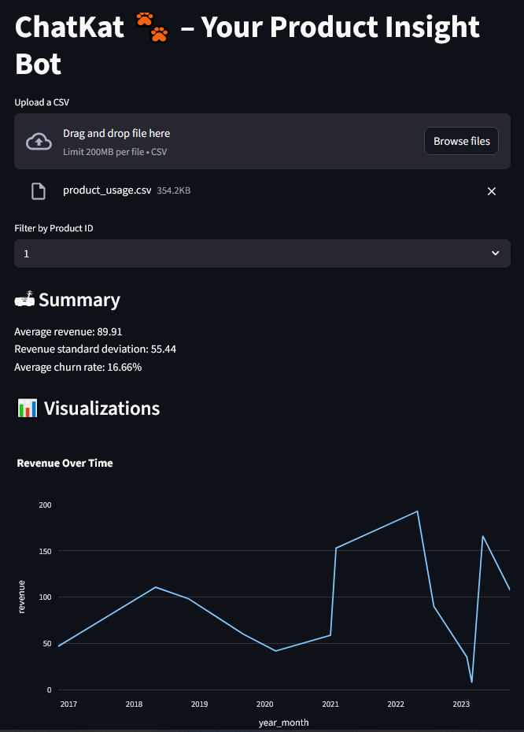
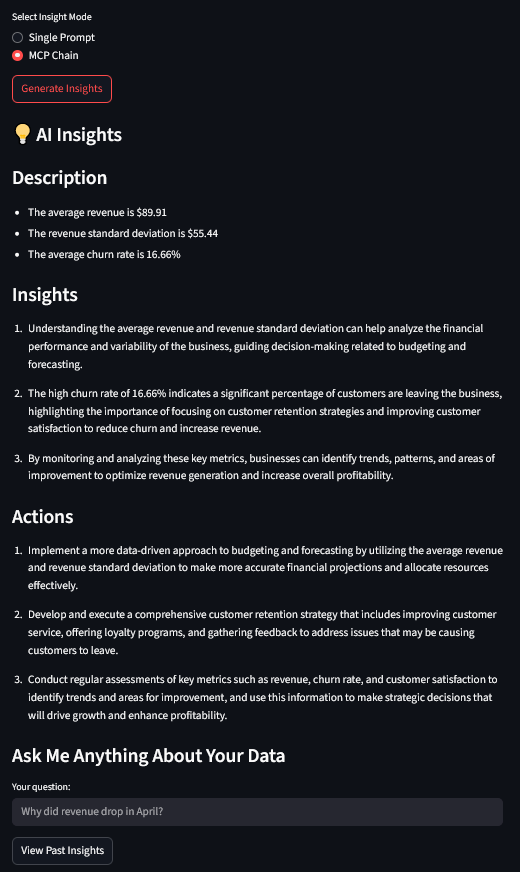

# ChatKat 🐾 – Product Insight Dashboard

ChatKat is a lightweight, interactive Streamlit dashboard that helps you uncover product and customer insights from CSV data. Upload your usage, revenue, or churn dataset — and let ChatKat summarize metrics, generate business insights using LLMs, and visualize trends.

[](https://chatkat.streamlit.app)

### Overview


### AI Insights Example


---

## 🔍 Features

- 📄 **CSV Upload & Auto Cleaning**
- 📊 **Visualizations** (Revenue trends, churn trends, product breakdown)
- 🤖 **Insight Generation via OpenAI**
- 🧠 **Ask Me Anything (AMA)** style querying
- 🧵 **MCP Chain Reasoning** (Optional multi-step insight flow)
- 💾 **Insight History Storage (SQLite)**

---

## 📦 Installation

```bash
git clone https://github.com/Hwangbot/ChatKat.git
cd ChatKat
pip install -r requirements.txt
